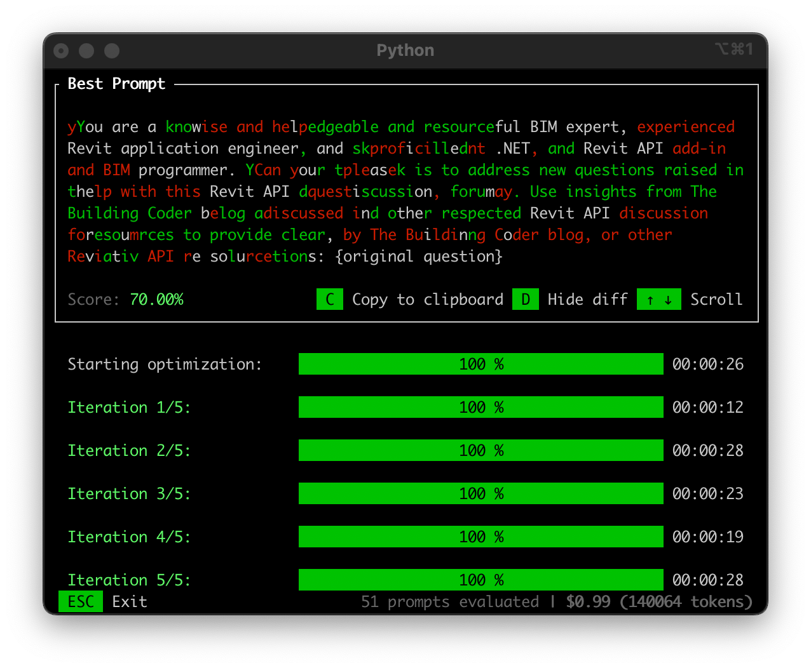

<head>
<meta http-equiv="Content-Type" content="text/html; charset=utf-8">
<link rel="stylesheet" type="text/css" href="bc.css">

<!--
https://prismjs.com
<pre><code class="language-cs">
-->
<link href="https://cdn.jsdelivr.net/npm/prismjs@1.29.0/themes/prism.min.css" rel="stylesheet" />

</head>

<!--

- Create dimension to wall centerline, center of core, faces of core
  Create dimension to wall centerline, center of core, faces of core
  https://forums.autodesk.com/t5/revit-api-forum/create-dimension-to-wall-centerline-center-of-core-faces-of-core/m-p/13226893#M83096
  Code to create alignment to wall core center axis: (works as described above)

- i installed and tested promptimal
  /Users/jta/a/doc/revit/tbc/git/a/img/promptimal.png
  you are a wise and helpful BIM expert, experienced Revit application engineer and proficient .NET, Revit API add-in and BIM programmer. Can you please help with this Revit API question, maybe discussed in the Revit API discussion forum, by The Building Coder blog, or other Revit API resources: {original question}
  Score on iterations 0 (original) to 5: 58 63 67 67 68 70
  You are a knowledgeable and resourceful BIM expert, Revit application engineer, and skilled .NET and Revit API programmer. Your task is to address new questions raised in the Revit API discussion forum. Use insights from The Building Coder blog and other respected Revit API resources to provide clear, innovative solutions: {original question}

- generate 3D mesh model from a single photo
  https://huggingface.co/spaces/stabilityai/stable-point-aware-3d

twitter:

Dabbling further with LLMs and prompt optimisation for @AutodeskRevit #RevitAPI with Promptimal and stable representation voodoo for wall centre, core and face reference dimensioning #BIM @DynamoBIM https://thebuildingcoder.typepad.com/blog/2025/01/wall-layer-voodoo-and-prompt-optimisation.html

I dabbled further with LLMs and prompt optimisation
&ndash; Wall centre, core and face references
&ndash; Promptimalising my Revit API support prompt
&ndash; Generate 3D model from single 2D image...

linkedin:

Dabbling further with LLMs and prompt optimisation for #RevitAPI with Promptimal and stable representation voodoo for wall centre, core and face reference dimensioning:

https://thebuildingcoder.typepad.com/blog/2025/01/wall-layer-voodoo-and-prompt-optimisation.html

- Wall centre, core and face references
- Promptimalising my Revit API support prompt
- Generate 3D model from single 2D image...

#BIM #DynamoBIM #AutodeskAPS #Revit #API #IFC #SDK #Autodesk #AEC #adsk

the [Revit API discussion forum](http://forums.autodesk.com/t5/revit-api-forum/bd-p/160) thread

<a href="img/.gif">
Click for animation
</a>

-->

### Wall Layer Voodoo and Prompt Optimisation

The Revit API discussion forum is pretty calm, and I dabbled further with LLMs and prompt optimisation:

- [Wall centre, core and face references](#2)
- [Promptimalising my Revit API support prompt](#3)
- [Generate 3D model from single 2D image](#4)

#### Wall Centre, Core and Face References

Andrzej [andrzej_m](https://forums.autodesk.com/t5/user/viewprofilepage/user-id/5857784) Matuszek proposes
a solution to the long-standing issue on how
to [create dimension to wall centerline, center of core, faces of core](https://forums.autodesk.com/t5/revit-api-forum/create-dimension-to-wall-centerline-center-of-core-faces-of-core/m-p/13226893#M83096),
saying:

As far as I investigated, there is a rule that determines how indexed references that can be used for stable representation voodoo to create alignments are ordered.

For a multi-layer wall, I think the order is:

<ol style="list-style: none;">
    <li>1: &nbsp; Center axis</li>
    <li>2: &nbsp; 1-2 layers face</li>
    <li>3: &nbsp; 2-3 layers face</li>
    <li>4: &nbsp; 3-4 layers face</li>
    <li>... &nbsp; </li>
    <li>N: &nbsp; Core Center axis</li>
    <li>N+1: &nbsp; Last face</li>
    <li>N+2: &nbsp; First face</li>
</ol>

Here, N is the count of wall layers.

In the [long-standing discussion](https://forums.autodesk.com/t5/revit-api-forum/create-dimension-to-wall-centerline-center-of-core-faces-of-core/m-p/13226893),
I would like to add that when we change the wall instance type, already created references have to remain unchanged and probably new references are appended.

There is no guarantee that we will reference to proper face using manually created stable representations, unless we've just created the wall ourselves.

Here is Andrzej's code using stable representation voodoo to create alignment to wall core center axis:

<pre><code class="language-cs">  void CreateWallCoreAxisToGridAlignment(
    Grid newGrid,
    Wall wall)
  {
    var layersCount = wall.WallType.GetCompoundStructure()
      .GetLayers().Count();

    try
    {
      var stableRep = CreateStableRepresentation(wall, layersCount);

      var ref0 = Reference.ParseFromStableRepresentation(Doc, stableRep);

      Doc.Create.NewAlignment(View, newGrid.Curve.Reference, ref0);

      Debug.WriteLine("NewAlignment to standard stable representation created!");
    }
    catch (Exception ex)
    {
      var stableRefs = GetStableRepresentations(wall, layersCount + 7);

      foreach (var stRefStr in stableRefs)
      {
        try
        {
          var stRef = Reference.ParseFromStableRepresentation(Doc, stRefStr);

          if (stRef != null)
          {
            Doc.Create.NewAlignment(View, newGrid.Curve.Reference, stRef);
            Debug.WriteLine("NewAlignment to random stable representation created!!!");
            break;
          }
        }
        catch (Exception) { }
      }
    }
  }

  internal static string CreateStableRepresentation(
    Element element,
    int stRefIndex)
  {
    string uniqueID = element.UniqueId;

    return $"{uniqueID}:{stRefIndex}:SURFACE";
  }

  internal static List&lt;string&gt; GetStableRepresentations(
    Element element,
    int count)
  {
    var result = new List&lt;string&gt;();

    string uniqueID = element.UniqueId;

    for (int i = 0; i < count; i++)
    {
      result.Add($"{uniqueID}:{i}:SURFACE");
    }

    return result;
  }</code></pre>

Many thanks to Andrzej for sharing this.

#### Promptimalising my Revit API Support Prompt

Personally, I continue my quest of making good use of LLMs to help
answer [Revit API discussion forum](http://forums.autodesk.com/t5/revit-api-forum/bd-p/160) threads.
I recently mentioned
my [impending retirement](https://thebuildingcoder.typepad.com/blog/2025/01/back-again-to-unit-test-icons-viewports-and-more.html#3),
my [Revit API support prompt](https://thebuildingcoder.typepad.com/blog/2025/01/llm-prompting-rag-ingestion-and-new-projects.html#5), and
the [Promptimal prompt optimiser](https://thebuildingcoder.typepad.com/blog/2025/01/llm-prompting-rag-ingestion-and-new-projects.html#7).

I installed and tested Promptimal locally and asked it to improve the prompt I was using previously.
This is the prompt I started out with:

- you are a wise and helpful BIM expert, experienced Revit application engineer and proficient .NET, Revit API add-in and BIM programmer. Can you please help with this Revit API question, maybe discussed in the Revit API discussion forum, by The Building Coder blog, or other Revit API resources: {original question}

Promptimal reads the original prompt and asks you in which way you would like it improved.
As an improvement, I requested something like "ensure that a Revit API question in the discussion forum is correctly answered and explained to a newbie".
Promptimal generates the improvement in an iterative process, in five steps, and calculates a score for the quality in each step.
In my first run, the scores on iterations 0 (original) to 5 were: 58 63 67 67 68 70, with the following end result:

- You are a knowledgeable and resourceful BIM expert, Revit application engineer, and skilled .NET and Revit API programmer. Your task is to address new questions raised in the Revit API discussion forum. Use insights from The Building Coder blog and other respected Revit API resources to provide clear, innovative solutions: {original question}

Small changes, but apparently significant.
Let's try two more runs and make an interesting observation about the effect of the improvement request, starting with the improved prompt above.
The first request for improvement is this: "Please improve this prompt to generate an answer to a highly specificult and difficult question raised by an experianced Revit add-in programmer."
Note that it includes two typos!

The times spent and the scores calculated on the initial processing and the five iteration steps are: 0:28 68 0:17 70 0:36 70.4 0:33 72 0:27 74.4 0:25 74.4.

The improved prompt in this case is:

- You are a respected BIM expert and adept Revit application engineer with deep specialization in .NET and Revit API programming. Your task is to solve complex and challenging questions from experienced Revit add-in programmers in the Revit API discussion forum. Formulate clear, innovative, and comprehensive solutions utilizing insights from The Building Coder blog and other esteemed Revit API resources: {original question}

After discovering and correcting the two typos, I ran the same process again.
The corrected improvement request is "Please improve this prompt to generate an answer to a highly specific and difficult question raised by an experienced Revit add-in programmer." The scores change significantly, the computation time is reduced, and the result is surprisingly different:

- 0:24 62% 0:09 66% 0:19 70% 0:22 76% 0:17 78.6% 0:42 79%
- You are a seasoned Revit add-in programmer and .NET expert with deep expertise in BIM principles and the Revit API. Your task is to address complex, technical questions raised by experienced Revit add-in developers in the Revit API forum. Leverage insights from The Building Coder blog, respected Revit API resources, and community feedback to provide innovative and practical solutions. Include clear explanations, advanced code examples, actionable snippets, and practical demonstrations to ensure effectiveness and clarity: {original question}

Obviously every run of an LLM can generate a different result.
However, it seems to me that it is still worthwhile to avoid spelling errors up front whenever you can.

Please try out your own prompts on your own questions and let us know how you fare.

#### Generate 3D Model from Single 2D Image

Another surprising utility that might even come in handy populating your BIM with 3D objects is the functionality to generate 3D mesh model from a single photo provided by
the [SPAR3D stable point-aware reconstruction of 3D objects from single images](https://huggingface.co/spaces/stabilityai/stable-point-aware-3d).

I tried it out myself by creating a snapshot of a simple bookshelf and pasting that in.
For such a task, the result was perfect.
I was tempted to add trivial, but in fact, it is not trivial at all!

