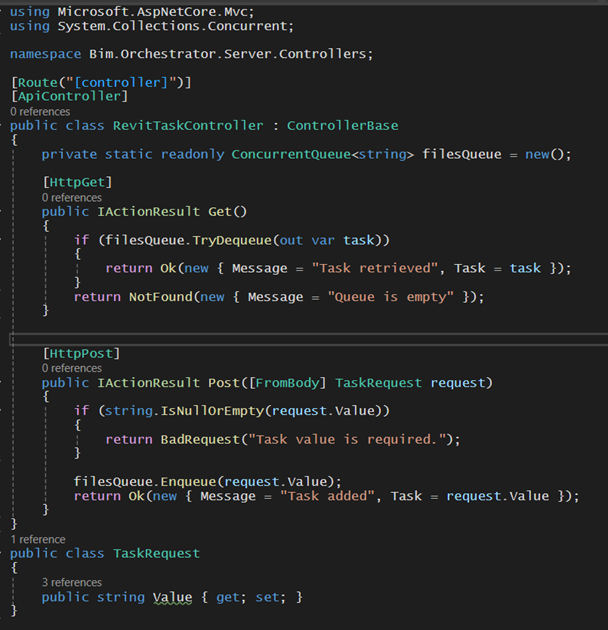
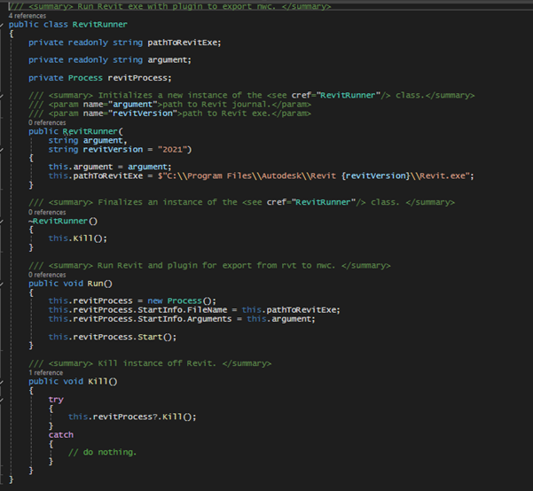
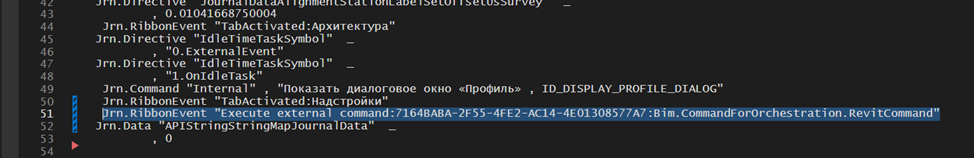
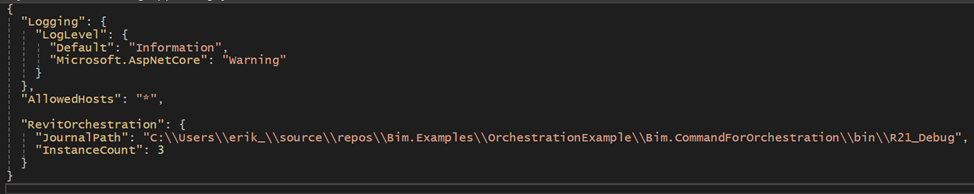
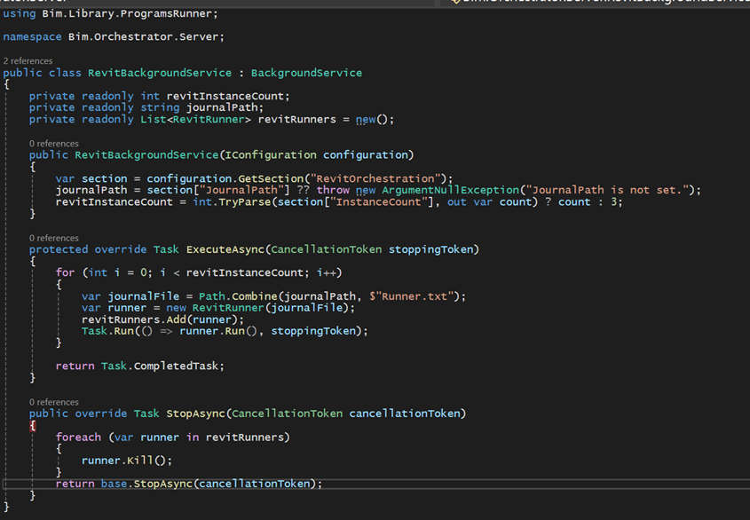
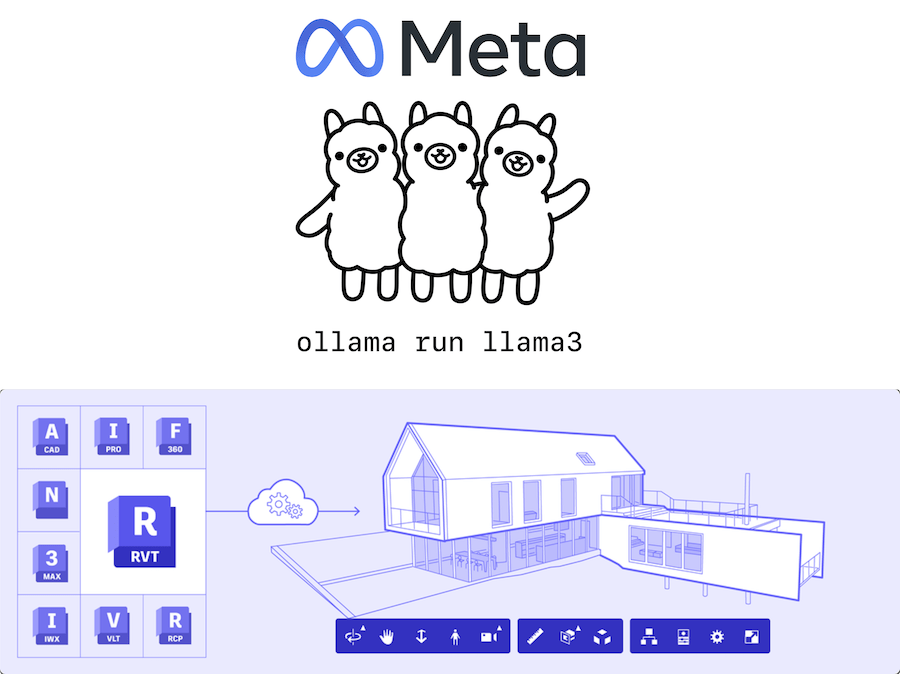
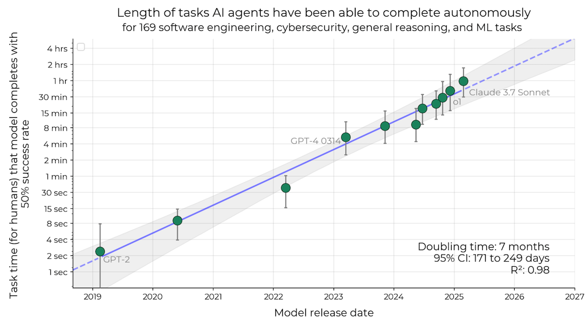

<head>
<meta http-equiv="Content-Type" content="text/html; charset=utf-8">
<link rel="stylesheet" type="text/css" href="bc.css">

<!--
https://prismjs.com
<pre><code class="language-cs">
-->
<link href="https://cdn.jsdelivr.net/npm/prismjs@1.29.0/themes/prism.min.css" rel="stylesheet" />

</head>

<!--

- feedspot
  From: Anuj Agarwal <dev@f1.feedspot.com>
  Date: Thursday, 20 March 2025 at 09:44
  To: Jeremy Tammik <jeremy.tammik@autodesk.com>
  Subject: The Building Coder featured in FeedSpot Top 25 Revit Blogs
  Hi Jeremy,
  My name is Anuj Agarwal, I'm the Founder of FeedSpot.
  I would like to personally congratulate you as your blog The Building Coder has been selected by our panelist as one of the Top 25 Revit Blogs on the web.
  https://bloggers.feedspot.com/revit_blogs/
  This is the most comprehensive list of Top 25 Revit Blogs on the internet and I'm honored to have you as part of this!
  You can also add your website link and other social media handles to get more visibility in our list and get discovered by brands for collaboration.
  We've created a badge for you to share with your audience. You can display it on your website or post it on social media to showcase this amazing milestone.
  We'd be grateful if you can help us spread the word by briefly mentioning about the Top 25 Revit Blogs list in any of your upcoming post.
  Please feel free to reach out with any questions.
  Best,
  Anuj

- [Erik Gette](https://github.com/erikgett) of [ГК Страна Девелопмент](https://strana.com)
  How to Debug Revit Plugins: Speeding Up Development
  https://www.linkedin.com/pulse/how-debug-revit-plugins-speeding-up-development-gette-erik-8usef/
  January 29, 2025
  > The Runner.txt file is a VBA script (Revit journal) that allows executing specific commands in Revit upon startup. Essentially, it can be used to trigger any sequence of actions automatically.
  In the context of my article, this file is used to launch Revit without any third-party plugins, ensuring a clean environment for testing and debugging.
  Interestingly, Revit generates similar log files for each session. These files can be read and analyzed, which opens up a range of automation possibilities. For example, in our workflow, we use these logs to orchestrate 10 running instances of Revit to export over 5,000 files into NWC format efficiently.
  The use cases for this approach are vast, and I plan to explore them in more detail in future articles. Stay tuned! 😊
  Navisworks orchestration on the server: how to execute typical tasks in parallel within the Navisworks environment
  https://www.linkedin.com/pulse/navisworks-orchestration-server-how-execute-typical-tasks-erik-gette-pmjjf/
  March 5, 2025
  Revit Orchestration on the Server: How to Execute Typical Tasks in Parallel in the Revit Context
  https://www.linkedin.com/pulse/revit-orchestration-server-how-execute-typical-tasks-parallel-gette-ct1wc/
  February 20, 2025

- Chuong HoChuong Ho
  Ollma3 LLM Agent APS WSL System (Autodesk Platform Services)
  https://youtu.be/-Nr-_ZgK8qI
  Exploring Open Source & Local LLM Ollama for Design Metadata Querying in Autodesk Platform Services! 🤖
  I'm excited to share my recent experiment with an open-source project that brings Local LLM AI and Autodesk Platform Services (APS) together! You can choose any model from your localhost with free AI open source model, and use this chatbot for a wide range of purposes!
  This is just the first version of my hackathon project, and I’m excited about how it turned out. A huge thanks to Petr Broz for the repository and inspiration!
  Check out the video below to see the real-time speed response using LLM on a local machine with WSL. It’s fascinating how fast and efficient the response time is!
  Make a comment if you want me to make a tutorials 🤖
  Open Source : https://lnkd.in/gkBw5ggV
  hashtag#OpenSource hashtag#LLM hashtag#Autodesk hashtag#BIM hashtag#Hackathon hashtag#AI hashtag#Chatbot hashtag#APIS hashtag#Technology hashtag#Innovation

- conversational voice generation and simulation demo
  https://www.sesame.com/research/crossing_the_uncanny_valley_of_voice#demo
  Sesame &ndash; Crossing the uncanny valley of conversational voice
  At Sesame, our goal is to achieve “voice presence”—the magical quality that makes spoken interactions feel real, understood, and valued.

twitter:

More online #RevitAPI docs, parallel add-in task orchestration on multiple @AutodeskRevit servers and local Ollama LLM @AutodeskAPS #BIM metadata queries @DynamoBIM https://thebuildingcoder.typepad.com/blog/2025/03/docs-local-aps-llm-and-parallel-task-orchestration.html

RvtDocs online Revit API docs, run free local open-source LLM queries on your BIM, and orchestrate add-in tasks in parallel on multiple servers
&ndash; Revit parallel task orchestration on the server
&ndash; Task queue controller
&ndash; RevitRunner class overview
&ndash; Creating the manifest
&ndash; Updating the journal
&ndash; Implementing the command
&ndash; Setting up the development environment
&ndash; Parallel execution on multiple Revit instances
&ndash; Managing Revit instances
&ndash; Moore's law for agent autonomy: 7 months
&ndash; Conversational voice generation...

linkedin:

More online #RevitAPI docs, parallel add-in task orchestration on multiple Revit servers and local Ollama LLM APS BIM metadata queries:

https://thebuildingcoder.typepad.com/blog/2025/03/docs-local-aps-llm-and-parallel-task-orchestration.html

-  Revit parallel task orchestration on the server
-  Task queue controller
-  RevitRunner class overview
-  Creating the manifest
-  Updating the journal
-  Implementing the command
-  Setting up the development environment
-  Parallel execution on multiple Revit instances
-  Managing Revit instances
-  Moore's law for agent autonomy: 7 months
-  Conversational voice generation...

#BIM #DynamoBIM #AutodeskAPS #Revit #API #IFC #SDK #Autodesk #AEC #adsk

the [Revit API discussion forum](http://forums.autodesk.com/t5/revit-api-forum/bd-p/160) thread

<a href="img/.gif">
Click for animation
</a>

-->

### Docs, Local APS LLM and Parallel Task Orchestration

More API online docs, run free local open-source LLM queries on your BIM, and orchestrate add-ins in parallel on multiple servers:

- [RvtDocs Revit API documentation](#2)
- [Erik Gette on debugging and parallel task orchestration](#3)
    - [Revit parallel task orchestration on the server](#3.1)
    - [Task queue controller &ndash; server API layer](#3.2)
    - [RevitRunner class overview](#3.3)
    - [Step 1: creating the manifest file](#3.4)
    - [Step 2: updating the journal file](#3.5)
    - [Step 3: implementing the command](#3.6)
    - [Step 4: setting up the development environment](#3.7)
    - [Step 5: parallel execution on multiple Revit instances](#3.8)
    - [Step 6: creating a class for managing Revit instances](#3.9)
    - [Conclusion](#3.10)
- [Local Ollama LLM APS metadata querying](#4)
- [Moore's law for agent autonomy: 7 months](#5)
- [Conversational voice generation](#6)

By the way, The Building Coder was selected by feedspot as one of
the [Top 25 Revit Blogs](https://bloggers.feedspot.com/revit_blogs/).
Thank you for the recognition, even if the list does look rather arbitrary to me...

#### RvtDocs Revit API Documentation

After a long lack of online API documentation for Revit 2025, we suddenly have a whole collection of choices, and competition is increasing.

The newest candidate is from Erik Frits of [LearnRevitAPI](https://learnrevitapi.com/), who launched yet another Revit API documentation website:

  
<a href="https://rvtdocs.com/">RvtDocs</a>

Welcome to the pack!

Here is an overview of the choices that I am aware of to date:

- [apidocs.co](https://apidocs.co) &ndash; Revit API documentation for 2015, 2016, 2017, 2017.1, 2018, 2018.1, 2018.2, 2019, 2019.1, 2019.2, 2020, 2020.1, 2021, 2021.1, 2022, 2022.1, 2023, 2024, 2025 and 2025.3, plus API documentation for Grasshopper, Navisworks and Rhino
- [Rev API Docs](https://revapidocs.com/) &ndash; Revit API documentation for 2020, 2021, 2022, 2023, 2024 and 2025, sister website of [Civ API Docs](https://civapidocs.com/), Civil 3D API documentation for 2022, 2023, 2024 and 2025
- [Revit API Docs](https://www.revitapidocs.com/) &ndash; Revit API documentation for 2021.1, 2022, 2023, 2024, 2025 and 2025.3
- [RVTDocs](https://rvtdocs.com/) &ndash; Revit API documentation for 2021, 2022, 2023, 2024 and 2025

#### Erik Gette on Debugging and Parallel Task Orchestration

[Erik Gette](https://github.com/erikgett) of [Strana Development, ГК Страна Девелопмент](https://strana.com)
kindly shared several in-depth tutorials on Revit and Navisworks debugging and parallel task orchestration:

- [Navisworks orchestration on the server: how to execute typical tasks in parallel within the Navisworks environment](https://www.linkedin.com/pulse/navisworks-orchestration-server-how-execute-typical-tasks-erik-gette-pmjjf/), March 5, 2025
- [Revit Orchestration on the Server: How to Execute Typical Tasks in Parallel in the Revit Context](https://www.linkedin.com/pulse/revit-orchestration-server-how-execute-typical-tasks-parallel-gette-ct1wc/), February 20, 2025
- [How to Debug Revit Plugins: Speeding Up Development](https://www.linkedin.com/pulse/how-debug-revit-plugins-speeding-up-development-gette-erik-8usef/) January 29, 2025

The debugging suggests an interesting approach using the journal file to launch Revit in the debugger:

> The Runner.txt file is a VBA script (Revit journal) that allows executing specific commands in Revit upon startup.
Essentially, it can be used to trigger any sequence of actions automatically.
In the context of my article, this file is used to launch Revit without any third-party plugins, ensuring a clean environment for testing and debugging.
Interestingly, Revit generates similar log files for each session.
These files can be read and analyzed, which opens up a range of automation possibilities.
For example, in our workflow, we use these logs to orchestrate 10 running instances of Revit to export over 5,000 files into NWC format efficiently.
The use cases for this approach are vast, and I plan to explore them in more detail in future articles. Stay tuned! 😊

Thank you, Erik, for your valuable research and documentation.
I'll share the Revit orchestration article here in full; please refer to Erik's LinkedIn publications for the others:

#### Revit Parallel Task Orchestration on the Server

In large-scale BIM projects, it is often necessary to perform the same operations on multiple models. This could include exporting models to various formats (NWC, IFC), extracting data for further analysis, or even more complex tasks related to automated model processing.

When the number of models grows too large, performing these operations manually becomes inefficient and, in the case of working with Revit and Navisworks, also resource intensive. The optimal solution is to organize server-side orchestration of these processes, where tasks are executed automatically based on a predefined scenario.

In this article, we will explore how to set up process management for Revit on a server to execute BIM tasks in batch mode. This approach allows you to:

- Automate model exports to NWC and IFC formats.
- Extract data from models and store it in a database.
- Perform any other repetitive tasks required for each company model.

Orchestrating these processes on the server significantly reduces processing time, eliminates human errors, and makes working with models more predictable and manageable.

#### Task Queue Controller &ndash; Server API Layer

This controller is a simplified API example that manages a task queue in the server’s memory. The main goal is to demonstrate how tasks can be added and retrieved using ConcurrentQueue.

How this controller works:

- Get method &ndash; Retrieves an item from the queue and removes it to ensure that the same task is not processed twice.
- Post method &ndash; Adds a new task to the queue. In a real-world scenario, this could be a file path or task-related information.

Limitations of this approach:

- The queue is stored in memory (ConcurrentQueue<string>), meaning tasks are lost if the server restarts.
- This approach is not suitable for a multi-server environment (horizontal scaling).
- There is no mechanism for retrying failed tasks or tracking their status.

What to use in a real project?

For reliable task processing, message brokers are recommended:

- RabbitMQ &ndash; A popular message broker, well-suited for distributed task processing.
- Kafka &ndash; Ideal for high-throughput and real-time event processing.
- Azure Queue Storage or AWS SQS &ndash; Suitable for cloud-deployed applications.
- Redis (List) &ndash; Can be used as a simple distributed queue with data persistence.

If you need to integrate RabbitMQ or another broker into this project, feel free to reach out
to [Erik](https://www.linkedin.com/in/erikgette/).

#### RevitRunner Class Overview

The [RevitRunner](https://github.com/erikgett/Bim.Examples/blob/master/Bim.Library/ProgramsRunner/RevitRunner.cs) class
is used to launch Revit with a journal file. This journal file can contain commands for automating tasks such as exporting NWC files or performing other operations.

🔹 How It Works?

- Create a RevitRunner object, specifying the path to the journal file (.txt) and the Revit version to be launched.
- Call the Run() method to start the Revit process with the given arguments.
- To forcefully close Revit, call the Kill() method.
- When the RevitRunner object is destroyed (~RevitRunner() destructor), Revit automatically shuts down. However, it's recommended to call Kill() manually when necessary.

#### Step 1: Creating the Manifest File

Before we move on to executing Revit processes, we need to configure and develop a Revit plugin.

The first step is to create
a [manifest file](https://github.com/erikgett/Bim.Examples/blob/master/OrchestrationExample/Bim.CommandForOrchestration/Bim.CommandForOrchestration.addin) for
our command.
This file defines the parameters and settings for the plugin.
It tells Revit how to load and execute our command, ensuring it integrates properly with the Revit environment.

#### Step 2: Updating the Journal File

Next, we need to call our command inside
the journal file ([Runner.txt](https://github.com/erikgett/Bim.Examples/blob/master/Bim.Examples/Runner.txt)).
This ensures that Revit executes the plugin correctly when launched.

⚠ Key point: The command ID in the manifest file and the journal file must be the same. This consistency is crucial for proper execution and debugging.

By maintaining this synchronization, we ensure that Revit picks up and runs our automation script without issues.

Now, let’s configure the journal file and see how it integrates with our command! 🚀

#### Step 3: Implementing the Command

After setting up the manifest and the journal file, the next step is writing
the [external command](https://github.com/erikgett/Bim.Examples/blob/master/OrchestrationExample/Bim.CommandForOrchestration/RevitCommand.cs) that
will execute tasks inside Revit.

The `RevitCommand` class implements the `IExternalCommand` interface, which allows it to be executed within Revit.
It runs in an infinite loop, constantly checking the server for new tasks.
When a task is found, it is processed accordingly.

How the Command Works:

- `Execute` Method:
    - This is the entry point for the command inside Revit. It simply calls ProcessQueue(), which runs continuously.
- `ProcessQueue` Method
  &ndash; This method handles the task retrieval and processing loop:
    - Sends a GET request to http://localhost:5140/RevitTask to check for new tasks.
    - If a task is found (response.IsSuccessStatusCode), it parses the JSON response to extract the task.
    - If the task is valid, it is passed to ExecuteTask().
    - If no tasks are available, the loop waits 10 seconds (Thread.Sleep(10000)) before the next request.
    - Handles exceptions to prevent crashes and keeps the process running.
- `ExecuteTask` Method
  &ndash; This method is responsible for executing the task. Here, you can implement various BIM automation processes, such as:
    - Exporting to IFC/NWC
    - Data validation
    - Uploading information to a database
    - Other automated workflows
- Final Thoughts
  &ndash; This solution enables automated task execution within Revit.
  The command continuously monitors the server and processes tasks without manual intervention.
  This approach is ideal for:
    - Automated model exports (IFC, NWC)
    - Data validation
    - Other repetitive BIM workflows requiring execution inside Revit

By implementing this method, you can significantly reduce manual effort, improve efficiency, and ensure consistency in your BIM processes.

#### Step 4: Setting Up the Development Environment

To streamline development and debugging, a profile has been created that allows you to run both the server and the client simultaneously.
This setup makes it easier to:

- Debug both the Revit application and the server in parallel
- Test the orchestration system efficiently
- Ensure smooth communication between Revit and the task queue

With this configuration, you can fine-tune your Revit automation workflow and optimize task execution seamlessly. 🚀

##### Convenient API Access with Scalar

In this test project, Scalar is used to simplify API interactions.
It provides a clean and efficient way to work with the task queue.
With Scalar, you can easily:

- Add new tasks to the queue
- Retrieve tasks for processing
- Improve API usability with a structured approach

This makes the orchestration process more manageable and scalable, ensuring a seamless workflow for handling Revit tasks on the server. 🚀

#### Step 5: Parallel Execution on Multiple Revit Instances

Now, let’s move on to the most exciting part—running our tasks in parallel on multiple instances of Revit.
To make the server configuration more flexible, we first need to update
the [appsettings.json file](https://github.com/erikgett/Bim.Examples/blob/master/OrchestrationExample/Bim.Orchestrator.Server/appsettings.json) by
adding fields that will allow us to:

- Specify the number of Revit instances to run
- Define paths to Revit executables
- Configure task queue settings

This approach ensures that tasks are distributed efficiently across multiple Revit processes, significantly reducing execution time and improving overall performance. 🚀

#### Step 6: Creating a Class for Managing Revit Instances

Now that we've set up the configuration, the next step is to create
a [class that will launch Revit instances on the server side](https://github.com/erikgett/Bim.Examples/blob/master/OrchestrationExample/Bim.Orchestrator.Server/RevitBackgroundService.cs).
This class will be responsible for:

- Automatically starting multiple Revit processes
- Distributing tasks across running instances
- Ensuring continuous execution in an infinite loop

With this setup, we can now use our API to enqueue an unlimited number of tasks, and they will be processed in parallel by three Revit instances. This approach ensures efficient workload distribution, minimizing idle time and optimizing execution speed. 🚀

We should also remember to register our service:

<pre><code class="language-cs">builder.Services.AddHostedService&lt;RevitBackgroundService&gt;();</code></pre>

#### Conclusion

Now we have the ability to batch-run tasks that can only be executed in the context of Revit.
This can significantly increase the productivity of the BIM department, as it allows us to integrate existing plugins into this logic and batch process large volumes of models on the server machine.

In the following articles, I will elaborate on how to implement a similar approach with Navisworks, which will expand our capabilities in automation and integration with other tools.

If you have any questions about collaboration or would like to discuss potential opportunities, feel free to reach out to me
on [Telegram](https://t.me/erikgette).
I look forward to connecting with you!
Let me know if you need any adjustments!

#### Local Ollama LLM APS Metadata Querying

[Chuong Ho](https://chuongmep.com/) published a one-minute video
on [Ollma3 LLM Agent APS WSL System (Autodesk Platform Services)](https://youtu.be/-Nr-_ZgK8qI):

> Exploring Open Source & Local LLM Ollama for Design Metadata Querying in Autodesk Platform Services!

> I'm excited to share my recent experiment with an open-source project that brings Local LLM AI and Autodesk Platform Services (APS) together!
You can choose any model from your localhost with free AI open source model, and use this chatbot for a wide range of purposes!
This is just the first version of my hackathon project, and I’m excited about how it turned out.
A huge thanks to Petr Broz for the repository and inspiration!

> Check out the video below to see the real-time speed response using LLM on a local machine with WSL.
It's fascinating how fast and efficient the response time is!

> [aps-local-chatbot GitHub repository](https://github.com/chuongmep/aps-ollma-chatbot)

> Simple chatbot for querying metadata of designs in Autodesk Platform Services using Ollama for chat completion.
This project connects a powerful local LLM with zero cost into Autodesk Platform Services.

Many thanks to Chuong Ho for implementing and sharing this exciting innovative project.

 <!-- Pixel Width: 900 -->

#### Moore's Law for Agent Autonomy: 7 Months

[Moore's law for agents: autonomy doubles every 7 months](https://buttondown.com/ainews/archive/ainews-every-7-months-the-moores-law-for-agent/), cf. the paper on [Measuring AI Ability to Complete Long Tasks](https://arxiv.org/pdf/2503.14499).

 <!-- Pixel Width: 1200 -->

> Figure 1: The length of tasks (measured by how long they take human professionals) that generalist autonomous frontier model agents can complete with 50% reliability has been doubling approximately every 7 months for the last 6 years. The shaded region represents 95% CI calculated by hierarchical bootstrap over task families, tasks, and task attempts. Even if the absolute measurements are off by a factor of 10, the trend predicts that in under a decade we will see AI agents that can independently complete a large fraction of software tasks that currently take humans days or weeks.

> At current rates, we will have:

> - 1 (human work-) day autonomy in (5 exponentials * 7 months) = 3 years (2028)
- 1 (human work-) month autonomy in "late 2029" (+/- 2 years, only going for human working hours)

#### Conversational Voice Generation

Non-Revit-related yet interesting to try out yourself, this conversational voice generation and simulation demo highlights
[Sesame &ndash; crossing the uncanny valley of conversational voice](https://www.sesame.com/research/crossing_the_uncanny_valley_of_voice#demo):

> At Sesame, our goal is to achieve 'voice presence' &ndash; the magical quality that makes spoken interactions feel real, understood, and valued.

