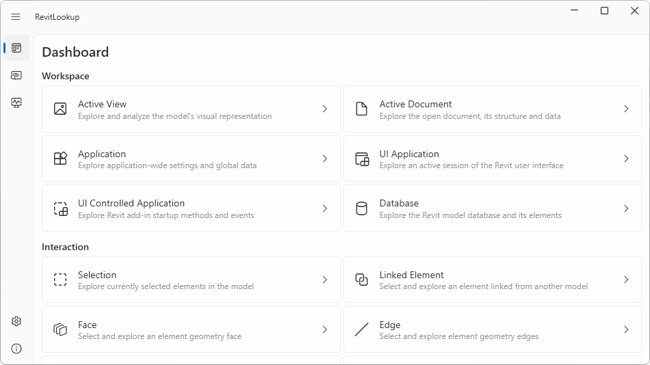
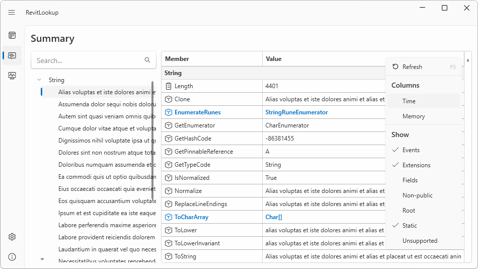
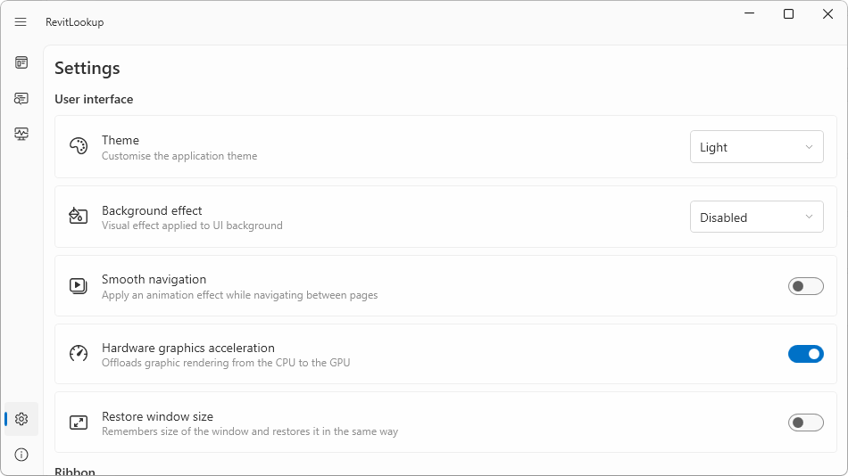
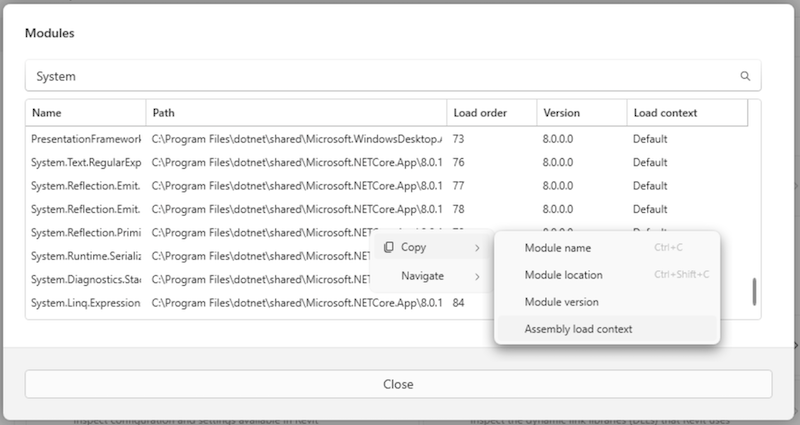
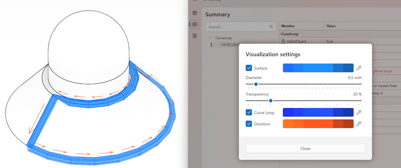

<head>
<meta http-equiv="Content-Type" content="text/html; charset=utf-8">
<link rel="stylesheet" type="text/css" href="bc.css">

<!--
https://prismjs.com
<pre><code class="language-cs">
-->
<link href="https://cdn.jsdelivr.net/npm/prismjs@1.29.0/themes/prism.min.css" rel="stylesheet" />

</head>

<!--

twitter:

RevitLookup 2026 based on new Lookup Foundation engine with Dashboard, Summary, Settings, Unit and Modules, @AutodeskAPS Design Automation API for @AutodeskRevit 2026, vibe coding macros and Direwolf fast data extraction with #RevitAPI #BIM @DynamoBIM https://thebuildingcoder.typepad.com/blog/2025/04/lookup-foundation-revitlookup-and-da4r-2026.html

In immediately reaction to the release of Revit 2026, DA4R and RevitLookup follow suite
&ndash; The Lookup Foundation
&ndash; RevitLookup 2026
&ndash; Dashboard, Summary, Settings pages
&ndash; Unit and Modules dialogues
&ndash; LookupEngine
&ndash; Design Automation API for Revit 2026
&ndash; Vibe programming Revit macros
&ndash; Direwolf fast Revit data extraction
&ndash; From floppies to a memory stick...

linkedin:

RevitLookup 2026 based on new Lookup Foundation engine with Dashboard, Summary, Settings, Unit and Modules, APS Design Automation API for Revit 2026, vibe coding macros and Direwolf fast data extraction with #RevitAPI

https://thebuildingcoder.typepad.com/blog/2025/04/lookup-foundation-revitlookup-and-da4r-2026.html

- The Lookup Foundation
- RevitLookup 2026
- Dashboard, Summary, Settings pages
- Unit and Modules dialogues
- LookupEngine
- Design Automation API for Revit 2026
- Vibe programming Revit macros
- Direwolf fast Revit data extraction
- From floppies to a memory stick...

#BIM #DynamoBIM #AutodeskAPS #Revit #API #IFC #SDK #Autodesk #AEC #adsk

the [Revit API discussion forum](http://forums.autodesk.com/t5/revit-api-forum/bd-p/160) thread

<a href="img/.gif">
Click for animation
</a>

-->

### Lookup Foundation, RevitLookup 2026 and DA4R 2026

In immediately reaction to the release of Revit 2026, DA4R and RevitLookup follow suite:

- [The Lookup Foundation](#2)
- [RevitLookup 2026](#3)
    - [General](#3.1)
    - [Dashboard page](#3.2)
    - [Summary page](#3.3)
    - [Settings page](#3.4)
    - [Unit dialogue](#3.5)
    - [Modules dialogue](#3.6)
    - [Application](#3.7)
    - [LookupEngine](#3.7)
    - [Improvements](#3.9)
    - [Development:](#3.10)
- [Design Automation API for Revit 2026](#4)
- [Vibe programming Revit macros](#5)
- [Direwolf fast Revit data extraction](#6)
- [From floppies to a memory stick](#7)

#### The Lookup Foundation

Roman [@Nice3point](https://t.me/nice3point) Karpovich, aka Роман Карпович,
has been heroically maintaining and enhancing RevitLookup for several years now.

He would like to expand and generalise it to implement a whole suite of tools for exploring the .NET objects.

For that purpose, we transferred ownership of the RevitLookup repository from my personal account to
the new [Lookup Foundation](https://github.com/lookup-foundation):

 <!-- width="1824" -->

GitHub redirects from the old URL to the new one, so existing links on the web will continue working:

> All links to the previous repository location are automatically redirected to the new location. When you use git clone, git fetch, or git push on a transferred repository, these commands will redirect to the new repository location or URL. However, to avoid confusion, we strongly recommend updating any existing local clones to point to the new repository URL

RevitLookup has been actively developed for many years, shaped by the contributions of a dedicated open-source community. Today, we mark an important milestone: the project transitions from its original home under Jeremy Tammik’s leadership to a new organization — the Lookup Foundation — where its development will be guided by the community that relies on it.

This transition ensures RevitLookup's continued growth as a community-driven project . RevitLookup is no longer just one person’s project; it belongs to the community that builds, tests, and improves it every day.

The Lookup Foundation will ensure the project remains open, sustainable, and driven by its users. Whether you're a developer, a Revit expert, or simply someone who benefits from the tool, you have a role to play in its evolution.

Please also refer to [Roman's LinkedIn announcement](https://www.linkedin.com/posts/nice3point_github-lookup-foundationrevitlookup-interactive-activity-7313236257206079488-JxpU?utm_source=share&utm_medium=member_desktop&rcm=ACoAAACogiYBX6lBbCXzDJBU_OWT9MYGMYk5X6g).

Once again, many thanks to Roman for all his hard work setting this up, and for the [numerous enhancements and migration to Revit 2026 discussed below](#3).

#### RevitLookup 2026

The Lookup Foundation released [RevitLookup 2026](https://github.com/lookup-foundation/RevitLookup/releases/tag/2026.0.0).

A new major RevitLookup update with official Revit 2026 support and a lot of enhancements 🎉

This release focuses on performance, a renewed UI, expanded functionality, redesigned application architecture, clearer separation of core components and user flow improvements. Let's move to the details.

##### General

- **Revit 2026** support.
- **Added shortcuts**. `SS` shortcut opens the Snoop Selection window.
- **Unlocked Ribbon buttons** for document-independent actions. Some dialogs can be opened without opening a document.
- **Improved context actions**. Now `Delete` command shows the number of deleted Elements from the document.
- **Improved exception handling**. Now shows more informational messages, added more supported error types. Fixed some application crashes.
- **Fixed dependency conflicts** for .NET Framework versions of RevitLookup, according to tests, you should no longer encounter startup issues.
- **Added AppBundle**, that can be installed with all available versions in the release.
- **Added user manuals**, visit the [Wiki](https://github.com/lookup-foundation/RevitLookup/wiki) for RevitLookup features.
- **Added digital signature**. Thanks [Kinship](https://kinship.io/) for providing cloud services!

##### Dashboard Page

The Dashboard has been significantly redesigned to make it easier to understand for users unfamiliar with the Revit API.

- **Added description** of all actions, navigation became more intuitive and clearer.
- **Added UiControlledApplication** action to analyze properties and methods available when running the add-in.
- **Actions now grouped** according to the window size.

##### Summary Page

Updated and improved Summary page components.

- **Improved responsiveness** of the whole page. RevitLookup now supports displaying large amounts of data, 100k rows will not cause freezes and glitches.
- **Improved shortcuts**, now the **F5** key works in all cases, previously it was required to focus on an element.
- **Improved filter menu**. Now applying **Show/hide** filters does not close the menu.
- **Improved tooltips**. Tooltips now display more useful information, number of elements contained in the type, full type name.
- **Improved search**. It is now more intuitive and faster. Priority is given to the members table, the table is filtered first, then if nothing is found, the list of items is filtered. When searching the table of members, the elements with the same type will be filtered as well.
- **Show Extension** filter is now enabled by default.
- **Patched WPF** issues causing non-obvious member's table behavior.

##### Settings Page

- **Added description** of all settings, navigation became more intuitive and clearer.

##### Unit Dialogue

- **Improved context menu**, Copy commands are grouped into sub-menu.

##### Modules Dialogue

- **Added new context menu** action. Added navigation to the module directory or directly to the module file.
- **Added column sorting**. Click on the column header to sort.
- **Improved context menu**, Copy commands are grouped into sub-menu.

##### Application

- **Adjusted default window sizes** for better display due to changes in Win.UI components.
- **Synchronised UI library** and styles with Wpf.UI.
- **Improved theme synchronization** with Windows.
- **Added a new high contrast** theme.

##### LookupEngine

RevitLookup now runs on its own [engine](https://github.com/lookup-foundation/LookupEngine).
The engine can run outside Revit, and can be reused across the entire family of Autodesk products.
This is a pledge for the future for products like **AutocadLookup**, **InventorLookup** and others.

Isolating the engine also brings many new improvements:

- **The engine is much faster** than the integrated version, it allocates less memory, and supports more features.
- **Added context support**, now allows additional metadata to be used to resolve members.
- **Fixed CLR exceptions** for critical .NET Core components when evaluating members.
- **New Lookup Engine API**. Isolation encouraged independent use of the API in any application.
- **Improved context detection**, objects now understand what context they are in and provide values specific to their context, not just the active context.
- **Added navigation stack**, now it will be easier to add support for new unsupported parent-dependent methods.

##### Improvements

- **Revit 2025.4 patch** brings some fixes to the API, now some methods and properties are available again for use in RevitLookup:
    - `DatumPlane.CanBeVisibleInView`
    - `DatumPlane.GetPropagationViews`
    - `IndependentTag.TagText`
- Added new **View** extensions:
    - `GetAllPlacedInstances`
- Added new **Wall** method overloads by @SergeyNefyodov:
    - `IsWallCrossSectionValid`
- Added new **CompoundStructure** method overloads by @SergeyNefyodov:
    - `CanLayerBeStructuralMaterial`
    - `CanLayerBeVariable`
    - `CanLayerWidthBeNonZero`
    - `GetAdjacentRegions`
    - `GetCoreBoundaryLayerIndex`
    - `GetDeckEmbeddingType`
    - `GetDeckProfileId`
    - `GetLayerAssociatedToRegion`
    - `GetLayerFunction`
    - `GetLayerWidth`
    - `GetMaterialId`
    - `GetNumberOfShellLayers`
    - `GetOffsetForLocationLine`
    - `GetPreviousNonZeroLayerIndex`
    - `GetRegionEnvelope`
    - `GetRegionsAssociatedToLayer`
    - `GetSegmentCoordinate`
    - `GetSegmentOrientation`
    - `GetWallSweepsInfo`
    - `GetWidth`
    - `IsCoreLayer`
    - `IsRectangularRegion`
    - `IsSimpleRegion`
    - `IsStructuralDeck`
    - `ParticipatesInWrapping`
- Visualisation now supports the new [CurveLoop](https://github.com/lookup-foundation/RevitLookup/wiki/Visualization#curveloop-visualization) type, thanks @JieGou for the implementation!

##### Development:

- **Redesigned project structure**:
    - Standalone [LookupEngine](https://github.com/lookup-foundation/LookupEngine). The LookupEngine is now a separate project, independent of RevitLookup.
    - Standalone [LookupEngine.UI](https://github.com/lookup-foundation/LookupEngine.UI). The LookupEngine UI is now a separate project, independent of RevitLookup.
    - UI Playground for development and testing the UI outside the Revit, independently.
- **Moving to Central Package Management**, all dependencies are now managed in a single file.
- **Moving to Central Build Management**, common build configurations are now managed in a single file.
- **Automatic registration of MVVM components** in the service provider, no longer need to register each component manually.
- **.NET 9 SDK support** for development.
- **Migrated to SLNX solution format**, to avoid Git merge conflicts.
- **Changed API for ContextMenu**. Now it provides dependencies and execution context.
- **Disabled PresentationFramework traces** for the entire domain to address UI performance issues and freezing under an attached debugger, leaving only Critical events enabled.
- **Updated** [Contribution](https://github.com/lookup-foundation/RevitLookup/blob/dev/Contributing.md) guide.

#### Design Automation API for Revit 2026

The [APS](https://aps.autodesk.com/) [Design Automation API](https://aps.autodesk.com/design-automation-apis) for
Revit 2026 has been released, DA4R 2026.

#### Vibe Programming Revit Macros

Michael Kilkelly shared
an [8-and-a-half minute video on LinkedIn](https://www.linkedin.com/posts/michaelkilkelly_revitapi-vibecoding-archsmarter-ugcPost-7311019788833546240-8Fho?utm_source=share&utm_medium=member_desktop&rcm=ACoAAACogiYBX6lBbCXzDJBU_OWT9MYGMYk5X6g) using
the Revit API launchpad
with [vibe coding](https://en.wikipedia.org/wiki/Vibe_coding) to
generate from scratch and execute Revit API macros.

Michael has been working with the Revit API and macros for a long time, cf. his 2015 tutorial
on [getting started with Revit macros](https://thebuildingcoder.typepad.com/blog/2015/10/rtc-classes-and-getting-started-with-revit-macros.html#7).

#### Direwolf Fast Revit Data Extraction

[Direwolf](https://github.com/Framebuffers/Direwolf) implements a data analysis framework for Autodesk Revit.
It extracts, serialises, and stores parameters from BIM models in fractions of a second.

#### From Floppies to a Memory Stick

I bought a 1 TB memory stick, and it got me thinking.
In the beginning of my programming career, we used [floppy disks](https://en.wikipedia.org/wiki/Floppy_disk).
They originally held 360 KB.

<pre>  kb = 1024 byte
  floppy = 360 * kb = 368640 byte
  mb = 1024 * kb = 1048576 byte
  tb = 1024 * mb = 1073741824 byte
  tb / floppy = 2912.711111</pre>

Assuming a floppy is 3 millimetres thick, my stick would be able to store that data from a stack of floppies about 2900 &middot; 0.003 = 8.7 metres high.
