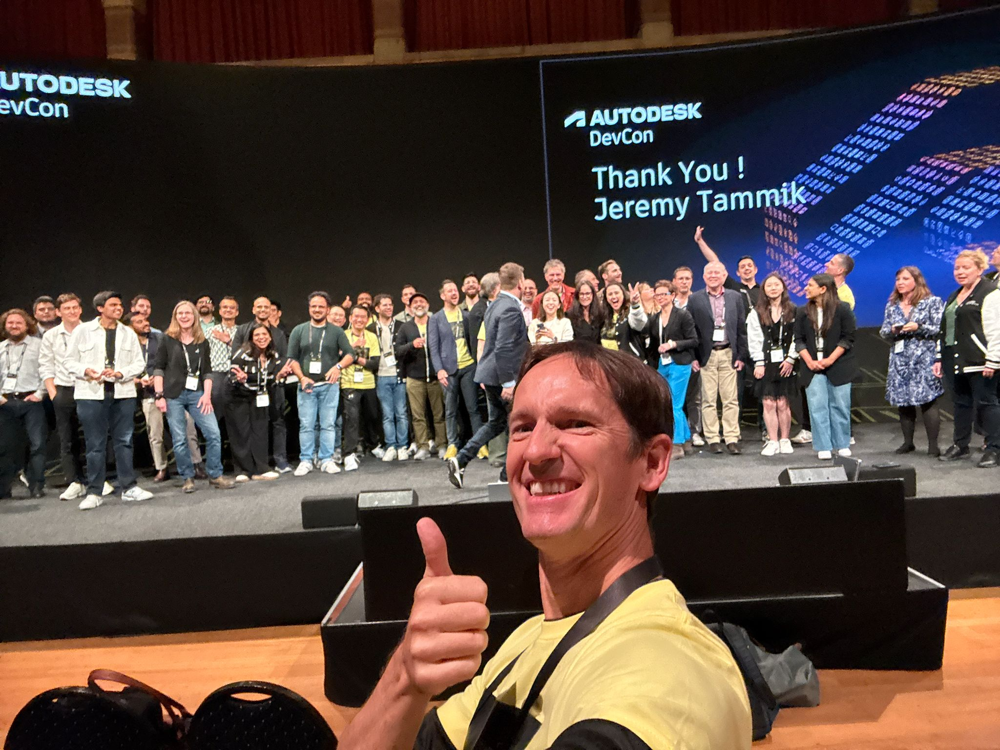
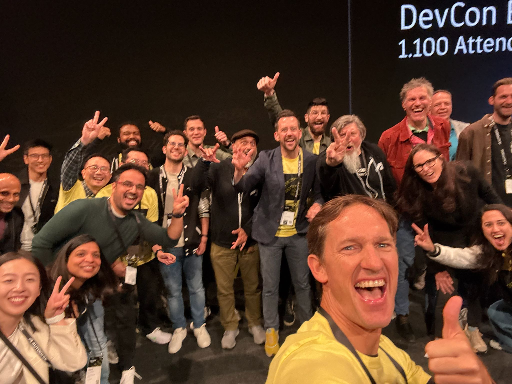
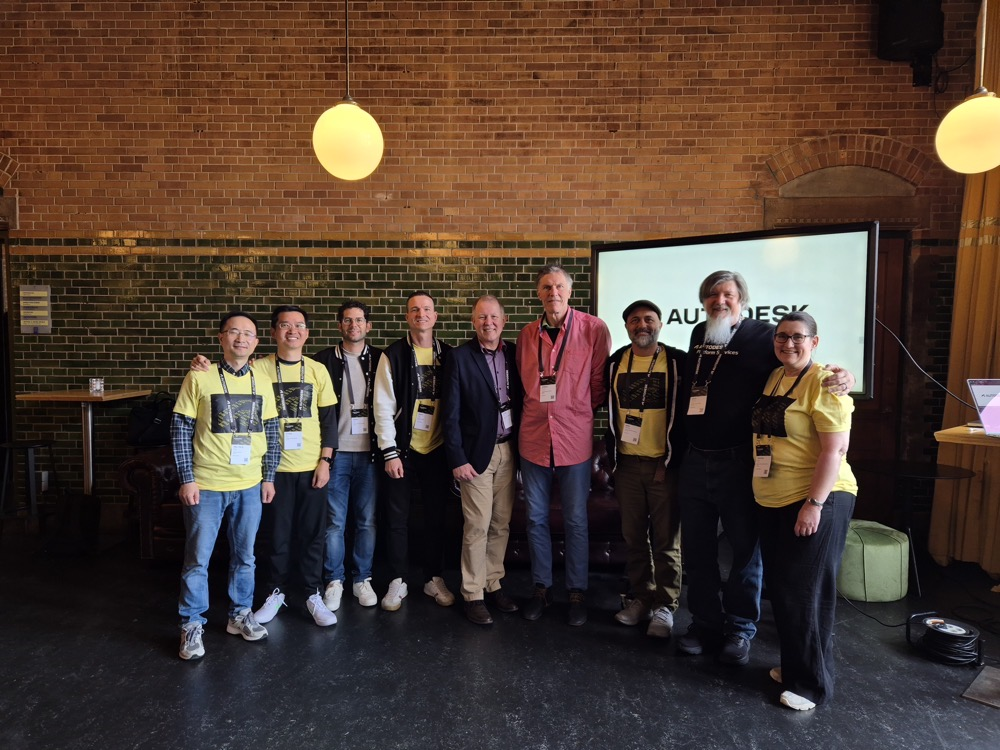

<head>
<meta http-equiv="Content-Type" content="text/html; charset=utf-8">
<link rel="stylesheet" type="text/css" href="bc.css">

<!--
https://prismjs.com
<pre><code class="language-cs">
-->
<link href="https://cdn.jsdelivr.net/npm/prismjs@1.29.0/themes/prism.min.css" rel="stylesheet" />

</head>

<!--

twitter:

DevCon 2025 Amsterdam was a great success with main topic AI agents data access API components and meetings with longstanding partners, teammates, selfies and appreciation @AutodeskRevit #RevitAPI @AutodeskAPS #BIM @DynamoBIM https://thebuildingcoder.typepad.com/blog/2025/05/ai-agents-and-selfies-at-devcon-2025.html

DevCon 2025 Amsterdam was a great success
&ndash; Main topic: agents using data
&ndash; Kean's event overview
&ndash; Teammate monster selfies
&ndash; More hellos and normal selfies...

linkedin:

DevCon 2025 Amsterdam was a great success with main topic AI agents data access API components and meetings with longstanding partners, teammates, selfies and appreciation for #RevitAPI

 https://thebuildingcoder.typepad.com/blog/2025/05/ai-agents-and-selfies-at-devcon-2025.html

- Main topic: agents using data
- Kean's event overview
- Teammate monster selfies
- More hellos and normal selfies...

#BIM #DynamoBIM #AutodeskAPS #Revit #API #IFC #SDK #Autodesk #AEC #adsk

the [Revit API discussion forum](http://forums.autodesk.com/t5/revit-api-forum/bd-p/160) thread

<a href="img/.gif">
Click for animation
</a>

-->

### AI Agents and Selfies at DevCon 2025

DevCon 2025 Amsterdam was a great success.
I am recuperating today and heading home by train tomorrow.
It was my last Autodesk event, and my time with Autodesk is nearing its end.
It was wonderful to see some many longstanding partners and hear about all your wonderful projects and visionary plans.

- [Main topic: agents using data](#2)
- [Kean's event overview](#3)
- [Teammate monster selfies](#4)
- [More hellos and normal selfies](#5)

#### Main Topic: Agents Using Data

[Amir Dezfouli](https://www.linkedin.com/in/amir-dezfouli-55a79b32/), CEO of [Bimlogiq](https://bimlogiq.com/),
succinctly summarised the main technical topics
[on LinkedIn](https://www.linkedin.com/posts/amir-dezfouli-55a79b32_i-just-wrapped-up-autodesk-devcon-2025-in-ugcPost-7330996207936344064-kfqX):

> Raji Arasu shared a forward-looking vision: replacing traditional add-ins with intelligent agents. These agents would have well-defined skill sets, automating tasks across platforms and shifting us beyond point-and-click interfaces to more complex workflow automation. This aligns well with the broader movement in AI toward agent-based systems and enabling platforms.

> Low-code and no-code tools powered by LLMs were a major focus. Anthony Sertorio gave a compelling presentation on how these systems can close skill gaps and automate complex workflows. In a related session, Gregory Fina and Petr Broz demonstrated how chatbots can be used for data access and calculations.

> Another clear direction was breaking down data silos. Many tools are now built for cloud-native environments—particularly Autodesk Platform Services. The new Autodesk Assistant reflects this shift, allowing users to access data through natural language.

> A personal highlight was meeting Jeremy Tammik, whose work on the Revit API has been a long-standing source of inspiration. Some of the ideas he’s shared over the years have been particularly helpful in how we approach no-code automation in tools like BIMLOGIQ Copilot.

> In one session, a poll asked: “If you could fix one issue in drawings, what would it be?” The top responses—cross-disciplinary mismatches, incorrect dimensions, and annotation clutter—highlight persistent pain points in the industry. These are exactly the kinds of challenges we’ve been tackling with AI-driven tools like Smart Annotation and vertically integrated automation solutions.

> While general-purpose foundation models are driving progress, there’s still a gap when it comes to models tailored specifically for AEC. Vertical AI—deeply embedded in domain workflows—feels like the next frontier.

I'd like to add that Raji also specifically highlighted that the importance of API documentation and end user interfaces may shrink, while the importance of <u>clearly defined and completely self-documenting functionality and components</u> might grow substantially.

Why?

Given clearly defined self-contained functionality with self-documenting interfaces, AIs can figure out for themselves the most effective ways to address a given step in a complex task and automatically build or configure appropriate agents and workflows to make use of such components with very little human intervention, or none at all.

Another vision of this trend and possible outcomes is discussed in depth by Rob Walling in his great nine-minute video
on [AI agents vs SaaS &ndash; who wins the future of software?](https://youtu.be/JGqvd10ZG8U).

#### Kean's Event Overview

Kean Walmsley presents an overview of the event in his article
on [DevCon Europe 2025 in Amsterdam &ndash; Days 1 and 2](https://www.keanw.com/2025/05/devcon-europe-2025-in-amsterdam-days-1-2.html).

#### Teammate Monster Selfies

My main occupation was shaking hands and posing for selfies, cf., [below](#5).

After closing, the team picture of the entire Autodesk DevCon team was spontaneously gate-crashed by my crazy genius colleague Michael Beale for this super monster selfie &ndash; with me grinning my head off in the brownish-orange shirt in the midlle:

 <!-- 2048 -->

That animated all of us and liberated some of the pent-up energy from these inspiring days and meetings:

 <!-- 2048 -->

We had a celebration with some of our important long-standing development partners and took a group picture with my closest European and Asian colleagues:

 <!-- 1000 -->

Unfortunately, my AEC-focused teammates in Nairobi and Mikako in the US were unable to make it.

#### More Hellos and Normal Selfies

<!--

Jose Fandos: auto-generation of revit api code, mcp, storage of all working code snippets for future reuse,...

BimLogiq: AI-supported automatic taggin and labelling with collision and overlap avoidance

/Users/jta/Pictures/2025/2025-05-21_devcon/

Miroslav Schonauer
Dear Jeremy, sorry that I missed to sign the kudos-board re your retirement (I was off for a bit and also have a new job/role in AEC data team, now working from Croatia), so pls accept the warmest wishes for the happy and most deserved period which I'm sure you'll be a master of enjoying :wink: It was such a pleasure working with you and knowing your enthusiasm and passion you put into the blog and generally helping our 3rd party developers! Hopefully, our paths may cross again (visiting Croatia soon :blush:?), let's try to stay in touch (miro5@btinternet.com, +44 7921 492 808) and all the best once again.

-->

Thank you for all the kind mentions and appreciation on LinkedIn and elsewhere:

- [Amir Dezfouli](https://www.linkedin.com/posts/amir-dezfouli-55a79b32_i-just-wrapped-up-autodesk-devcon-2025-in-ugcPost-7330996207936344064-kfqX)
- [Bert van der Hoeven](https://www.linkedin.com/posts/bert-van-der-hoeven-6b51b124_devon-revit-api-activity-7330849280678633472-iYFC)
- [Deyan Nenov and Lejla Secerbegovic](https://www.linkedin.com/posts/deyan-nenov_autodesk-devcon-revitapi-ugcPost-7330677357378170880-uST2)
- [Ilia Ivanov](https://www.linkedin.com/posts/ilia-ivanov-298997161_autodeskdevcon-jeremytammik-autodeskplatform-activity-7330627797788323841-gsjp)
- [Sandip Jadhav](https://www.linkedin.com/posts/ugcPost-7331091576963702785-wLYd?utm_source=share&utm_medium=member_desktop&rcm=ACoAAACogiYBX6lBbCXzDJBU_OWT9MYGMYk5X6g)

... and ever so many more!

Thank you!

Keep in touch!

<!--
LinkedIn notifications

João Paulo Ornelas MartinsStatus is online
João Paulo Ornelas Martins and 27 others reacted to Sandip Jadhav’s post that mentioned you.

#DevCon2025 by Autodesk Platform Services was a great opportunity to meeting old friends and making the new friends from worlds largest software development community in the CAD, BIM and data space. Michelangelo Capraro, GAURAV B. Mayank Mridul, Vijaya Adigopula, Associate Director, Lejla Secerbegovic, Torsten Kohl, Jeremy Tammik, Rahul, Amit Kumar Aman, Mike Engel, Pawan Kumar and many more. It was a great pleasure to meet all of you at the 10th DevCon and I hope we meet again next year. #autodesk #cctech #APS #API #digitaltransformation #software #connectingtheminds #CAD #BIM #data #developerconferance
28 reactions
5m

 Magnus Nilsen ✨Status is reachable
Magnus Nilsen ✨ and 57 others reacted to Amir Dezfouli’s post that mentioned you.

I just wrapped up Autodesk DevCon 2025 in Amsterdam, the leading conference for developers and innovators building on Autodesk’s platform. Raji Arasu shared a forward-looking vision: replacing traditional add-ins with intelligent agents. These agents would have well-defined skill sets, automating tasks across platforms and shifting us beyond point-and-click interfaces to more complex workflow automation. This aligns well with the broader movement in AI toward agent-based systems and enabling platforms. Low-code and no-code tools powered by LLMs were a major focus. Anthony Sertorio gave a compelling presentation on how these systems can close skill gaps and automate complex workflows. In a related session, Gregory Fina and Petr Broz demonstrated how chatbots can be used for data access and calculations. Another clear direction was breaking down data silos. Many tools are now built for cloud-native environments—particularly Autodesk Platform Services. The new Autodesk Assistant reflects this shift, allowing users to access data through natural language. A personal highlight was meeting Jeremy Tammik, whose work on the Revit API has been a long-standing source of inspiration. Some of the ideas he’s shared over the years have been particularly helpful in how we approach no-code automation in tools like BIMLOGIQ Copilot. In one session, a poll asked: “If you could fix one issue in drawings, what would it be?” The top responses—cross-disciplinary mismatches, incorrect dimensions, and annotation clutter—highlight persistent pain points in the industry. These are exactly the kinds of challenges we’ve been tackling with AI-driven tools like Smart Annotation and vertically integrated automation solutions. While general-purpose foundation models are driving progress, there’s still a gap when it comes to models tailored specifically for AEC. Vertical AI—deeply embedded in domain workflows—feels like the next frontier.
58 reactions  2 comments
1h

 Deyan Nenov
Deyan Nenov and 1 other liked Lejla Secerbegovic’s comment that mentioned you.

Thanks so much for the great shot, Deyan Nenov! Meeting Jeremy Tammik is always a highlight - and it was a great pleasure to meet you as well at this DevCon! 🙂
🎤 #Autodesk #DevCon Day 1 Meeting the legendary Jeremy Tammik — seen here casually chatting with Lejla Secerbegovic — was a personal highlight. 🙏 I finally had the chance to thank him for jump-starting my career (and no doubt many others’) in coding against the Revit API. 💡 If you've ever dabbled in #RevitAPI, you probably owe a nod to #TheBuildingCoder.
92 reactions  6 comments
5h

 Sandip Jadhav is hiring
Sandip Jadhav mentioned you in a post.

#DevCon2025 by Autodesk Platform Services was a great opportunity to meeting old friends and making the new friends from worlds largest software development community in the CAD, BIM and data space. Michelangelo Capraro, GAURAV B. Mayank Mridul, Vijaya Adigopula, Associate Director, Lejla Secerbegovic, Torsten Kohl, Jeremy Tammik, Rahul, Amit Kumar Aman, Mike Engel, Pawan Kumar and many more. It was a great pleasure to meet all of you at the 10th DevCon and I hope we meet again next year. #autodesk #cctech #APS #API #digitaltransformation #software #connectingtheminds #CAD #BIM #data #developerconferance
28 reactions
6h

 Jan SmolíkStatus is reachable
Jan Smolík and 3 others reacted to Václav Smolík’s post that mentioned you.

𝐖𝐡𝐞𝐫𝐞 𝐢𝐬 𝐁𝐈𝐌 𝐡𝐞𝐚𝐝𝐢𝐧𝐠 𝐭𝐡𝐞𝐬𝐞 𝐝𝐚𝐲𝐬? 🤔 Despite often facing the demanding nature of BIM implementation and the reluctance of designers to fully embrace project digitalization, it's crucial to recognize the significant progress civil engineering has already made and that we've entered a new era. Our BIMtwin team recently attended Autodesk DEVCON, which broadened our horizons, provided valuable inspiration, and allowed us to establish key contacts on a global scale. At this event, Autodesk clearly outlined the main development directions for this year: 𝐒𝐔𝐒𝐓𝐀𝐈𝐍𝐀𝐁𝐈𝐋𝐈𝐓𝐘, 𝐃𝐈𝐆𝐈𝐓𝐀𝐋 𝐓𝐑𝐀𝐍𝐒𝐅𝐎𝐑𝐌𝐀𝐓𝐈𝐎𝐍, and 𝐀𝐑𝐓𝐈𝐅𝐈𝐂𝐈𝐀𝐋 𝐈𝐍𝐓𝐄𝐋𝐋𝐈𝐆𝐄𝐍𝐂𝐄. These pillars also resonate with BIMtwin's vision and our commitment to innovative digital tools. I personally greatly appreciate the opportunity to meet the Revit API legend, Jeremy Tammik, in person. I'm also pleased that we weren't the only representatives from the Czech Republic, and that companies like VECTORAMA, Atelier 99 s.r.o. or STRABAG are actively exploring the potential for further BIM development in our region. #BIM #Construction #Digitalization #Sustainability #ArtificialIntelligence #AutodeskDEVCON #BIMtwin
4 reactions
6h

 View BIM Coordinators Summit
BIM Coordinators Summit posted an article: Beyond Instant Answers.
8h

 Thomas Dizeldorf
Thomas Dizeldorf and 6 others reacted to Bo Hu’s post that mentioned you.

Meet “The building coder” auther Mr Jeremy Tammik in Autodesk DevCon!
7 reactions
10h

 Václav SmolíkStatus is reachable
Václav Smolík mentioned you in a post.

𝐖𝐡𝐞𝐫𝐞 𝐢𝐬 𝐁𝐈𝐌 𝐡𝐞𝐚𝐝𝐢𝐧𝐠 𝐭𝐡𝐞𝐬𝐞 𝐝𝐚𝐲𝐬? 🤔 Despite often facing the demanding nature of BIM implementation and the reluctance of designers to fully embrace project digitalization, it's crucial to recognize the significant progress civil engineering has already made and that we've entered a new era. Our BIMtwin team recently attended Autodesk DEVCON, which broadened our horizons, provided valuable inspiration, and allowed us to establish key contacts on a global scale. At this event, Autodesk clearly outlined the main development directions for this year: 𝐒𝐔𝐒𝐓𝐀𝐈𝐍𝐀𝐁𝐈𝐋𝐈𝐓𝐘, 𝐃𝐈𝐆𝐈𝐓𝐀𝐋 𝐓𝐑𝐀𝐍𝐒𝐅𝐎𝐑𝐌𝐀𝐓𝐈𝐎𝐍, and 𝐀𝐑𝐓𝐈𝐅𝐈𝐂𝐈𝐀𝐋 𝐈𝐍𝐓𝐄𝐋𝐋𝐈𝐆𝐄𝐍𝐂𝐄. These pillars also resonate with BIMtwin's vision and our commitment to innovative digital tools. I personally greatly appreciate the opportunity to meet the Revit API legend, Jeremy Tammik, in person. I'm also pleased that we weren't the only representatives from the Czech Republic, and that companies like VECTORAMA, Atelier 99 s.r.o. or STRABAG are actively exploring the potential for further BIM development in our region. #BIM #Construction #Digitalization #Sustainability #ArtificialIntelligence #AutodeskDEVCON #BIMtwin
4 reactions
10h

 Saidah Naimi
Saidah Naimi and 10 others reacted to Bert van der Hoeven’s post that mentioned you.

Meeting Jeremy Tammik on #Devon #revit #api in Amsterdam. Nice to see you.
12 reactions  1 comment
10h

 Raji Arasu
Raji Arasu, Chief Technology Officer, EVP at Autodesk shared a post: Just wrapped an inspiring week at TechX—our internal, employee-driven conference in Las Vegas—where we brought together over 1,000 Autodeskers in person, and many more virtually. TechX is all about investing in ourselves—connecting with peers, learning from experts, and sparking the kinds of conversations that move us forward. When you bring together thousands of product development professionals with intention, amazing things happen: ideas flow, decisions get made, and alignment happens in real-time (not over five days of email or Slack threads). This year, we focused on what matters most: building great technology and empowering the people who build it. I’m coming out of this week energized and committed to creating more of these meaningful, high-impact moments, because the momentum we build here lasts long after the conference ends. #Autodesk #TechX #Innovation #Leadership #Teamwork #ProductDevelopment
11h

Peter Madlener
Peter Madlener and 21 others reacted to Ilia Ivanov’s post that mentioned you.

Great to meet the legend - Jeremy Tammik! It was a pleasure to finally meet in person someone whose work has supported and inspired developers worldwide for years. Jeremy is not just an expert - he’s a true bridge between the Autodesk platform and the developer community. Thank you for everything you do! #AutodeskDevCon #JeremyTammik #AutodeskPlatform #DeveloperCommunity
23 reactions  1 comment
11h

 Hamidreza Ghader
Hamidreza Ghader and 1 other commented on Amir Dezfouli’s post that mentioned you.

Great recap Amir! Fascinating to see how agent-based systems and vertical AI are becoming central themes across industries. I'm working on similar ideas in e-commerce. Would love to catch up if you're still around Amsterdam!
I just wrapped up Autodesk DevCon 2025 in Amsterdam, the leading conference for developers and innovators building on Autodesk’s platform. Raji Arasu shared a forward-looking vision: replacing traditional add-ins with intelligent agents. These agents would have well-defined skill sets, automating tasks across platforms and shifting us beyond point-and-click interfaces to more complex workflow automation. This aligns well with the broader movement in AI toward agent-based systems and enabling platforms. Low-code and no-code tools powered by LLMs were a major focus. Anthony Sertorio gave a compelling presentation on how these systems can close skill gaps and automate complex workflows. In a related session, Gregory Fina and Petr Broz demonstrated how chatbots can be used for data access and calculations. Another clear direction was breaking down data silos. Many tools are now built for cloud-native environments—particularly Autodesk Platform Services. The new Autodesk Assistant reflects this shift, allowing users to access data through natural language. A personal highlight was meeting Jeremy Tammik, whose work on the Revit API has been a long-standing source of inspiration. Some of the ideas he’s shared over the years have been particularly helpful in how we approach no-code automation in tools like BIMLOGIQ Copilot. In one session, a poll asked: “If you could fix one issue in drawings, what would it be?” The top responses—cross-disciplinary mismatches, incorrect dimensions, and annotation clutter—highlight persistent pain points in the industry. These are exactly the kinds of challenges we’ve been tackling with AI-driven tools like Smart Annotation and vertically integrated automation solutions. While general-purpose foundation models are driving progress, there’s still a gap when it comes to models tailored specifically for AEC. Vertical AI—deeply embedded in domain workflows—feels like the next frontier.
58 reactions  2 comments
12h

 Amir Dezfouli
Amir Dezfouli mentioned you in a post.

I just wrapped up Autodesk DevCon 2025 in Amsterdam, the leading conference for developers and innovators building on Autodesk’s platform. Raji Arasu shared a forward-looking vision: replacing traditional add-ins with intelligent agents. These agents would have well-defined skill sets, automating tasks across platforms and shifting us beyond point-and-click interfaces to more complex workflow automation. This aligns well with the broader movement in AI toward agent-based systems and enabling platforms. Low-code and no-code tools powered by LLMs were a major focus. Anthony Sertorio gave a compelling presentation on how these systems can close skill gaps and automate complex workflows. In a related session, Gregory Fina and Petr Broz demonstrated how chatbots can be used for data access and calculations. Another clear direction was breaking down data silos. Many tools are now built for cloud-native environments—particularly Autodesk Platform Services. The new Autodesk Assistant reflects this shift, allowing users to access data through natural language. A personal highlight was meeting Jeremy Tammik, whose work on the Revit API has been a long-standing source of inspiration. Some of the ideas he’s shared over the years have been particularly helpful in how we approach no-code automation in tools like BIMLOGIQ Copilot. In one session, a poll asked: “If you could fix one issue in drawings, what would it be?” The top responses—cross-disciplinary mismatches, incorrect dimensions, and annotation clutter—highlight persistent pain points in the industry. These are exactly the kinds of challenges we’ve been tackling with AI-driven tools like Smart Annotation and vertically integrated automation solutions. While general-purpose foundation models are driving progress, there’s still a gap when it comes to models tailored specifically for AEC. Vertical AI—deeply embedded in domain workflows—feels like the next frontier.
58 reactions  2 comments
12h

 Jaime Cossent HidalgoStatus is reachable
Jaime Cossent Hidalgo and 25 others reacted to Kevin Himmelreich’s post that mentioned you.

Hace 4 años tuve el placer de compartir con los compañeros de BIMrras en "Los Cursos de los viernes", y para mí es un placer escuchar este tipo de entrevistas con verdaderos referentes del sector. 🎙️ En esta ocasión, Jeremy Tammik, un gran referente en el mundo BIM, nos ofrece su perspectiva y experiencia. ¡No te la pierdas! 👉 https://lnkd.in/d9bJKqyZ Además, si te interesa profundizar más en el mundo BIM, te animo a seguir "Los cursos de los viernes" (LCDLV) de BIMRRAS. Aquí tienes mi participación por si quieres verla: 👉 https://lnkd.in/dUwfJJyn Es increíble cómo iniciativas como estas siguen inspirando y aportando muchísimo al crecimiento de la comunidad BIM. Gracias Evelio E. Sánchez Juncal , Rogelio Carballo Solla y Rafael Tenorio Aranguren #BIM #Revit #BIMRRAS #Entrevista #Innovación #Tecnología #ConstrucciónDigital #JeremyTammik #ReferentesBIM #FormaciónBIM
26 reactions  3 comments
13h

 View BIM Coordinators Summit
BIM Coordinators Summit posted: 🚀 New Partner Announcement! We’re thrilled to welcome iAcoustics to the BIM Heroes community! 🎉 Based in Dublin, iAcoustics is a leading acoustic consultancy delivering technology-driven, BIM-integrated solutions across the built environment. With expertise in architectural and environmental acoustics, they’re redefining how acoustic performance is designed, coordinated, and delivered. From acoustic testing to full-scope consultancy, iAcoustics is trusted by architects, developers, and design teams across Ireland and beyond - and now, they’re joining us to share their innovation with the BIM Heroes network. 👉 Check out their work and join their community: https://lnkd.in/extgk4gt #BIMHeroes #Acoustics #OpenBIM #iAcoustics #AEC #Architecture #Innovation #BIMCommunity
17h

 Deyan Nenov
Deyan Nenov replied to Lejla Secerbegovic’s comment that mentioned you.

It was a real pleasure meeting you, Lejla Secerbegovic! I'm genuinely impressed by the work your team is doing with Data Exchange—such an exciting space to be in. And now I know exactly who to reach out to when the questions start rolling in 😉
🎤 #Autodesk #DevCon Day 1 Meeting the legendary Jeremy Tammik — seen here casually chatting with Lejla Secerbegovic — was a personal highlight. 🙏 I finally had the chance to thank him for jump-starting my career (and no doubt many others’) in coding against the Revit API. 💡 If you've ever dabbled in #RevitAPI, you probably owe a nod to #TheBuildingCoder.
92 reactions  6 comments
20h

 Deyan Nenov
Deyan Nenov liked Amitabh Mukherjee’s comment that mentioned you.

Thanks, Jeremy Tammik! Hopefully we will meet face to face some day.
🎤 #Autodesk #DevCon Day 1 Meeting the legendary Jeremy Tammik — seen here casually chatting with Lejla Secerbegovic — was a personal highlight. 🙏 I finally had the chance to thank him for jump-starting my career (and no doubt many others’) in coding against the Revit API. 💡 If you've ever dabbled in #RevitAPI, you probably owe a nod to #TheBuildingCoder.
92 reactions  6 comments
20h

 Bert van der HoevenStatus is reachable
Bert van der Hoeven mentioned you in a post.

Meeting Jeremy Tammik on #Devon #revit #api in Amsterdam. Nice to see you.
12 reactions  1 comment
22h

 Amitabh MukherjeeStatus is online
Amitabh Mukherjee mentioned you in a comment.

Thanks, Jeremy Tammik! Hopefully we will meet face to face some day.
🎤 #Autodesk #DevCon Day 1 Meeting the legendary Jeremy Tammik — seen here casually chatting with Lejla Secerbegovic — was a personal highlight. 🙏 I finally had the chance to thank him for jump-starting my career (and no doubt many others’) in coding against the Revit API. 💡 If you've ever dabbled in #RevitAPI, you probably owe a nod to #TheBuildingCoder.
92 reactions  6 comments
22h

 Victoria Ikede
Victoria Ikede and others have added 6 comments on Deyan Nenov’s post.

Fairly certain that a lot of Revit API ‘vibe code’ from A.I. is built off the back of his blog. Such a great moment!
🎤 #Autodesk #DevCon Day 1 Meeting the legendary Jeremy Tammik — seen here casually chatting with Lejla Secerbegovic — was a personal highlight. 🙏 I finally had the chance to thank him for jump-starting my career (and no doubt many others’) in coding against the Revit API. 💡 If you've ever dabbled in #RevitAPI, you probably owe a nod to #TheBuildingCoder.
92 reactions  6 comments
1d

 Lejla Secerbegovic
Lejla Secerbegovic mentioned you in a comment.

Thanks so much for the great shot, Deyan Nenov! Meeting Jeremy Tammik is always a highlight - and it was a great pleasure to meet you as well at this DevCon! 🙂
🎤 #Autodesk #DevCon Day 1 Meeting the legendary Jeremy Tammik — seen here casually chatting with Lejla Secerbegovic — was a personal highlight. 🙏 I finally had the chance to thank him for jump-starting my career (and no doubt many others’) in coding against the Revit API. 💡 If you've ever dabbled in #RevitAPI, you probably owe a nod to #TheBuildingCoder.
92 reactions  6 comments
1d

 Bo Hu
Bo Hu mentioned you in a post.

Meet “The building coder” auther Mr Jeremy Tammik in Autodesk DevCon!
7 reactions
1d

 Ilia IvanovStatus is online
Ilia Ivanov mentioned you in a post.

Great to meet the legend - Jeremy Tammik! It was a pleasure to finally meet in person someone whose work has supported and inspired developers worldwide for years. Jeremy is not just an expert - he’s a true bridge between the Autodesk platform and the developer community. Thank you for everything you do! #AutodeskDevCon #JeremyTammik #AutodeskPlatform #DeveloperCommunity
23 reactions  1 comment
1d

------
jeremytammik2

 Alex Dodonov
Unread notification.
Alex Dodonov and 94 others reacted to Deyan Nenov’s post that mentioned you.

🎤 #Autodesk #DevCon Day 1 Meeting the legendary Jeremy Tammik — seen here casually chatting with Lejla Secerbegovic — was a personal highlight. 🙏 I finally had the chance to thank him for jump-starting my career (and no doubt many others’) in coding against the Revit API. 💡 If you've ever dabbled in #RevitAPI, you probably owe a nod to #TheBuildingCoder.
95 reactions  6 comments
1h

 Kean WalmsleyStatus is reachable
Unread notification.
Kean Walmsley liked Mustafa Salaheldin Ali Bakr’s comment that mentioned you.

sorry guys, I couldn't make it to Amesterdam, but really loved the pictures and best of luck to Jeremy Tammik
Blog: DevCon Europe 2025 in Amsterdam - Days 1 & 2 https://lnkd.in/e2eBS3iY
76 reactions  2 comments
3h

 Mustafa Salaheldin Ali BakrStatus is online
Unread notification.
Mustafa Salaheldin Ali Bakr mentioned you in a comment.

sorry guys, I couldn't make it to Amesterdam, but really loved the pictures and best of luck to Jeremy Tammik
Blog: DevCon Europe 2025 in Amsterdam - Days 1 & 2 https://lnkd.in/e2eBS3iY
76 reactions  2 comments
6h

 Julian Wandzilak
Unread notification.
Julian Wandzilak and 5 others commented on Deyan Nenov’s post that mentioned you.

Similar story here! Saying "thanks" to Jaremy was on my todo list for this event!
🎤 #Autodesk #DevCon Day 1 Meeting the legendary Jeremy Tammik — seen here casually chatting with Lejla Secerbegovic — was a personal highlight. 🙏 I finally had the chance to thank him for jump-starting my career (and no doubt many others’) in coding against the Revit API. 💡 If you've ever dabbled in #RevitAPI, you probably owe a nod to #TheBuildingCoder.
95 reactions  6 comments
15h

 Jörg Pipo
Unread notification.
Jörg Pipo reacted to Sam Kadra's post: What an experience at #AutodeskDevCon2025 in Amsterdam! The sessions went far beyond expectations, real conversations, hands-on demos, and future-forward ideas around BIM, APS, digital transformation, automation, and data integration. It wasn’t just about learning; it was about reimagining how we build smarter, faster, and more connected. I’ve always found Petr Broz ’s sessions to be among the most insightful and this year was no different. His take on APS and how it’s changing the way we collaborate across platforms really hit home. I walked away with a head full of ideas and practical inspiration to bring back to our BIM IT workflows. Big thanks to the whole Autodesk team for making this event such a success. And a special shoutout to our Autodesk Customer Success Manager Melissa Böck, I really appreciated the thoughtful conversations and your constant support during the event. You brought clarity and practical insight to every topic we discussed and I’ve come away with plenty of ideas to explore! Let’s turn vision into action and build a future we’re proud of together.🚀 #SiemensEnergy #AutodeskDevCon2025 #FutureOfBIM #DigitalTransformation #APS #AI #DesignAutomation #ACC #Revit #DataExchange #Autodesk #Innovation #BIM #TechLeadership
38 reactions  6 comments
17h

 View TED Conferences
Unread notification.
1625 people are attending an event created by TED Conferences this week. View the event.1625 people are attending an event created by TED Conferences this week. View the event.
1d

 Deyan NenovStatus is reachable
Unread notification.
Deyan Nenov mentioned you in a post.

🎤 #Autodesk #DevCon Day 1 Meeting the legendary Jeremy Tammik — seen here casually chatting with Lejla Secerbegovic — was a personal highlight. 🙏 I finally had the chance to thank him for jump-starting my career (and no doubt many others’) in coding against the Revit API. 💡 If you've ever dabbled in #RevitAPI, you probably owe a nod to #TheBuildingCoder.
95 reactions  6 comments
1d

----

Olivier MARTIN ARCAS
BIM software developer

Hi Jeremy,

We quickly met at Devcon this week. I want to thank you again for “The Building Coder”.

In 2012 I decided to make a career change and I joined one of the biggest French construction company as BIM Developer. Thanks to you I quickly increased my skills and I was able to provide efficient processes and related tools in the Autodesk ecosystem. Since, I never stopped coding.

I wish you all the best in your retirement.

Best Regards,

Jeremy Tammik

Dear Olivier, nice of you to drop by and thank you for your kind appreciation. I am glad I was able to make a difference! Best of luck and much success to you! Cheers, Jeremy.

-->

